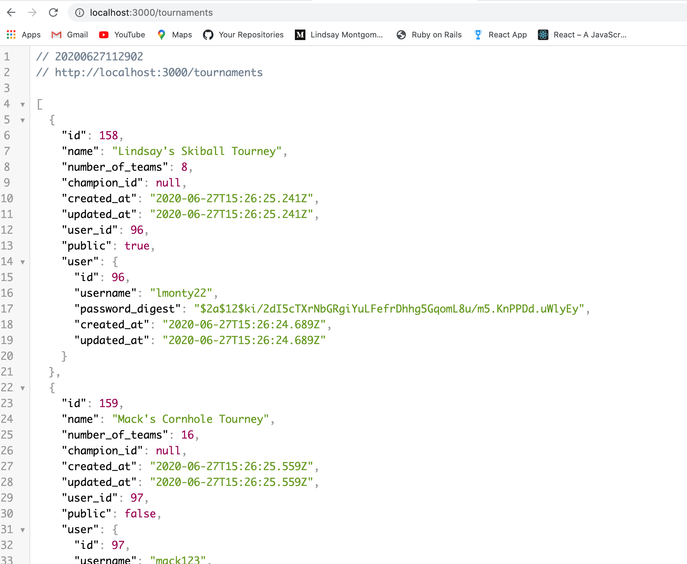

# BrackIt - BackEnd

Ruby version => "2.6.1"

## Summary

This is a tournament bracket generator designed to allow users to generate and manage tournament BrackIts while their friends follow along. Users can create BrackIts with 4, 8, 16, 32 or 64 teams. Tournaments can be private (unsearchable) or public. First round matchups can be random by selecting 'shuffle teams' or the tournament creator can manually decide first round match ups when entering team names. You may record scores, advance teams and edit team names, and edit tournament details, throughout the Torurnament and finally crown a champion. 

Additional features allow you to search for (public) tournaments and follow tournaments. 

## Instructions

1. Clone down this repo and cd into the directory

2. #Create Your Own Secret Key.
    This repo relies on JWT to generate tokens to be stored in localstorage. JWT requires a secret key to decode and encode user information. Create a .env file in the top level of the directory to store your secret key. This file should already be added to gitIgnore and will not be pushed to gitHub. Your .env file should look something like this:
    `SECRET_KEY= 'YourSecretKeyString'`

3. Run 
`bundle install`

4. Run
`rails db:migrate`

5. Run
`rails db:seed`

6. Run
`rails s`

7. Rails should now be running the Postgres api on http://localhost:3000. You can check the tournaments route going to http://localhost:3000/tournaments in your browser.

8. Make sure to clone down the [BrackIt Frontend Repo](https://github.com/lmonty22/brackIt-front-end/) and follow the front end Readme instructions next! 

9. If you have previously downloaded and ran this repo, you may encounter a localstorage error if a locally stored token is invalid in your new database. Run `localstorage.clear()` in your console. 

## RSPEC Tests

1. There are tests for backend models written in Rpec

2. Make sure models are running successfully by running `rspec`

